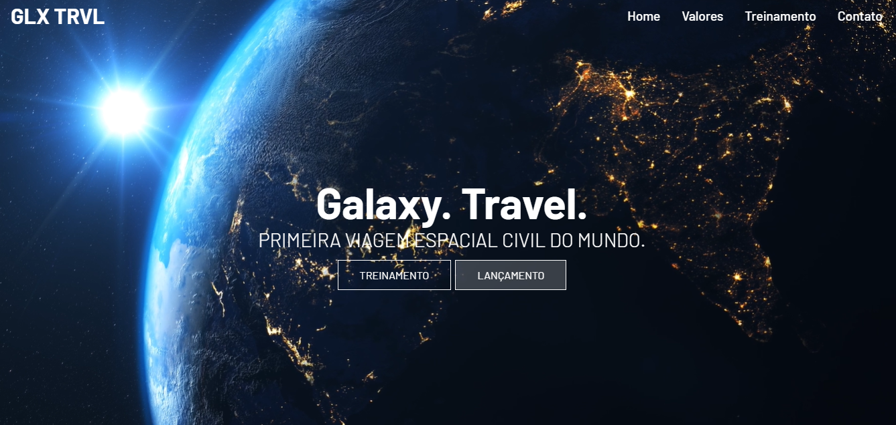

# GLX-TRVL

## 🎯 Objetivo

Esta aplicação é uma landing page desenvolvida com o objetivo exercitar a utilização de React Router Dom.

## 🛠️ Tecnologias utilizadas

Para o desenvolvimento deste site utilizei as seguintes tecnologias:

- HTML;
- CSS;
- React;
- React Icons;
- React Router Dom;

## 🚀 Como executar o projeto

1. Clone este repositório

`$ https://github.com/giovanaraphaelli/glx-trvl.git`

2. Acesse a pasta do projeto no seu terminal/cmd

`$ cd glx-trvl`

3. Abra a pasta do projeto no VS Code via terminal/cmd

`$ code .`

4. Instale as dependências

`$ yarn install`

5. Execute a aplicação em modo de desenvolvimento

`$ yarn start`

6. A aplicação será aberta na porta: 3000 - acesse http://localhost:3000
